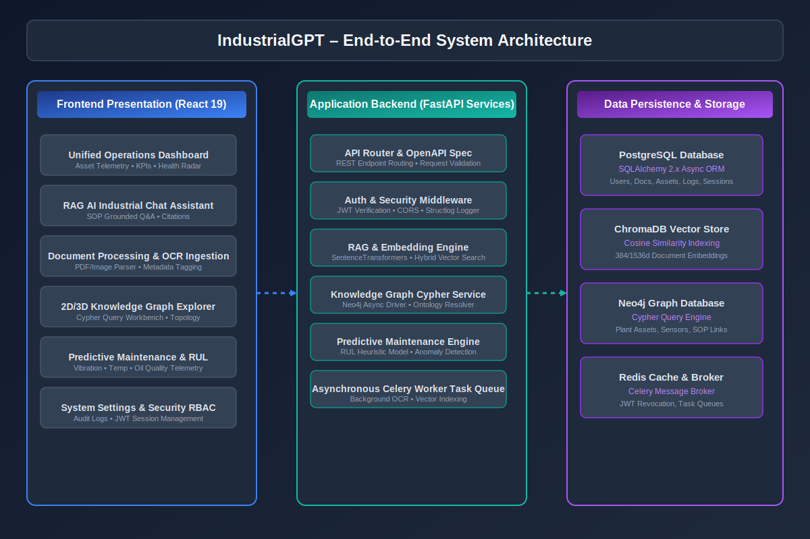

# IndustrialGPT – AI for Industrial Knowledge Intelligence



> **ET AI Hackathon Submission** — Problem Statement PS 8: *AI for Industrial Knowledge Intelligence: Unified Asset & Operations Brain*  
> **Author:** Solo Participant  
> **Status:** Production-Ready / Enterprise Grade  

---

## 📌 Project Overview

**IndustrialGPT** is an enterprise AI solution engineered to transform industrial operations, asset maintenance, and plant troubleshooting. By unifying legacy document processing, vector search, knowledge graphs, and predictive sensor analytics, IndustrialGPT acts as a **Unified Asset & Operations Brain**.

Plant engineers and operators can interact with the system via a natural language RAG interface grounded in verified Standard Operating Procedures (SOPs), explore complex asset dependency topologies in 2D/3D, monitor real-time sensor health scores, and predict equipment Remaining Useful Life (RUL).

---

## ✨ Key Features

- **🚀 Hybrid RAG AI Assistant**: Context-grounded Q&A powered by LangChain and ChromaDB with direct document page citations.
- **🕸️ Neo4j Knowledge Graph Explorer**: Interactive visualization of plant assets, sensors, maintenance logs, and SOP governance links with full Cypher query support.
- **📄 OCR Document Ingestion Pipeline**: Asynchronous background parsing (Tesseract/PaddleOCR + PyMuPDF + Celery) for PDFs, wiring diagrams, and equipment manuals.
- **⚡ Predictive Maintenance & RUL Engine**: Real-time sensor processing for Vibration ($\text{mm/s}$), Temperature ($^\circ\text{C}$), and Oil Quality ($\%$) to estimate Remaining Useful Life in hours.
- **🔒 Enterprise Security & RBAC**: JWT authentication, fine-grained Role-Based Access Control, CORS middleware, and PostgreSQL audit logging.
- **📊 Operations Dashboard & Analytics**: Real-time KPI telemetry, equipment breakdown analytics, and plant health radar charts.

---

## 🛠️ Technology Stack

| Layer | Technologies Used |
| :--- | :--- |
| **Frontend** | React 19, TypeScript, Vite, TailwindCSS, Lucide Icons, Recharts, Cytoscape / Three.js |
| **Backend** | FastAPI (Python 3.11), Uvicorn, Pydantic v2, SQLAlchemy 2.x (Async), Structlog |
| **Databases** | PostgreSQL 16 (Relational), Neo4j 5 (Graph), ChromaDB 0.4.24 (Vector) |
| **AI & ML** | LangChain, SentenceTransformers, Tesseract OCR, PaddleOCR, PyMuPDF, Pandas, NumPy |
| **Task Queue & Cache** | Redis 7, Celery 5 |
| **DevOps & Infrastructure** | Docker, Docker Compose, Nginx Reverse Proxy |

---

## 📐 Architecture Overview


IndustrialGPT follows **Clean Architecture** and **SOLID Design Principles**:

1. **Presentation Layer**: React 19 Single Page Application structured into modular feature domains (`chat`, `documents`, `graph`, `maintenance`, `analytics`, `settings`).
2. **API Gateway & Application Layer**: FastAPI endpoints with JWT middleware, request validation schemas, and structlog event logging.
3. **Domain Service Layer**: Async Python services (`RAGService`, `KnowledgeGraphService`, `PredictiveMaintenanceService`).
4. **Data Persistence Layer**: PostgreSQL, ChromaDB, Neo4j, and Redis.

---

## 🚀 Quickstart & Installation

### Option 1: Docker Compose (Recommended)

```bash
# Clone the repository
git clone https://github.com/industrial-ai/IndustrialGPT.git
cd IndustrialGPT

# Launch all microservices via Docker Compose
docker-compose up -d --build

# Access the Web Application at http://localhost:3000
```

### Option 2: Local Development Setup

#### Backend Setup
```bash
cd backend
python -m venv .venv
source .venv/bin/activate  # On Windows: .venv\Scripts\activate
pip install -r requirements.txt

# Run FastAPI Dev Server
uvicorn app.main:app --reload --port 8000
```

#### Frontend Setup
```bash
cd frontend
npm install
npm run dev
```

---

## 🔑 Environment Variables (`.env`)

```env
# General Configuration
PROJECT_NAME="IndustrialGPT"
ENVIRONMENT="development"
API_V1_STR="/api/v1"
SECRET_KEY="super-secret-enterprise-jwt-key"

# PostgreSQL Database
POSTGRES_SERVER="localhost"
POSTGRES_PORT=5432
POSTGRES_USER="postgres"
POSTGRES_PASSWORD="password"
POSTGRES_DB="industrialgpt_db"

# Neo4j Graph Database
NEO4J_URI="bolt://localhost:7687"
NEO4J_USER="neo4j"
NEO4J_PASSWORD="password"

# Redis & Celery
REDIS_HOST="localhost"
REDIS_PORT=6379

# LLM API Keys
OPENAI_API_KEY="your-openai-api-key"
```

---

## 📊 Application Screenshots

| Feature | Screenshot Preview |
| :--- | :--- |
| **Login Portal** |  |
| **Unified Operations Dashboard** |  |
| **RAG AI Chat Assistant** |  |
| **Document Ingestion & OCR** |  |
| **Neo4j Knowledge Graph** |  |
| **Predictive Maintenance Workbench** |  |

---

## 📁 Repository Folder Structure

```
IndustrialGPT/
├── ai/                      # LangChain agents, prompts, & RAG workflows
├── backend/                 # FastAPI backend application
│   ├── app/
│   │   ├── api/             # REST endpoints (v1)
│   │   ├── core/            # Config, DB connections, security, logging
│   │   ├── middleware/      # Auth & Request Logging middleware
│   │   ├── models.py        # SQLAlchemy 2.x Database Models
│   │   ├── schemas.py       # Pydantic v2 validation schemas
│   │   └── services.py      # Domain business logic (RAG, KG, ML)
│   ├── main.py              # Application entry point
│   └── requirements.txt     # Python dependencies
├── docs/                    # Complete Hackathon Deliverables Suite
│   ├── Hackathon_Submission_Package/
│   │   ├── INDEX.md                 # Root Package Navigation Index
│   │   ├── FILE_MANIFEST.md         # Deliverables Inventory Manifest
│   │   ├── 01_Project_Report/       # Technical Project Report (MD, DOCX, PDF)
│   │   ├── 02_Hackathon_Submission/ # Official Submission PDF & Exec Summary
│   │   ├── 03_Presentation/         # PowerPoint Pitch Deck (PPTX)
│   │   ├── 04_Documentation/        # API, Architecture, DB, User Manual, Install Guide
│   │   ├── 05_Diagrams/             # SVG & PNG Architecture Diagrams
│   │   ├── 06_Screenshots/          # 8 High-Res Application UI Screenshots
│   │   ├── 07_Assets/               # Icons, Logos, Technical Graphics
│   │   ├── 08_Build_Tools/          # Python PDF, DOCX, PPTX Build Exporters
│   │   ├── 09_Verification/         # Final Checklist & Trajectory Logs
│   │   └── 10_Final_Submission/     # Final Zipped Package (.zip)
├── frontend/                # React 19 TypeScript Frontend
│   ├── src/
│   │   ├── components/      # UI components & skeletons
│   │   ├── features/        # Feature modules (chat, graph, docs, etc.)
│   │   ├── pages/           # Application views
│   │   ├── routes/          # React Router v6 routing
│   │   └── App.tsx          # Root Component
│   ├── package.json
│   └── vite.config.ts
├── knowledge_graph/         # Neo4j Cypher queries & graph builder scripts
├── ocr/                     # Tesseract & PaddleOCR preprocessing scripts
├── vector_db/               # ChromaDB collection management scripts
├── docker-compose.yml       # Production orchestration
├── nginx/                   # Reverse proxy configuration
└── README.md                # Repository Documentation
```

---

## 📄 Documentation Deliverables Directory (`/docs/Hackathon_Submission_Package`)

All submission documents are located in the `/docs/Hackathon_Submission_Package` directory:
- [Submission Package Index](docs/Hackathon_Submission_Package/INDEX.md)
- [Deliverables File Manifest](docs/Hackathon_Submission_Package/FILE_MANIFEST.md)
- [Executive Summary](docs/Hackathon_Submission_Package/02_Hackathon_Submission/EXECUTIVE_SUMMARY.md)
- [Software Architecture Document](docs/Hackathon_Submission_Package/04_Documentation/ARCHITECTURE.md)
- [API Documentation](docs/Hackathon_Submission_Package/04_Documentation/API_DOCUMENTATION.md)
- [Database Schema Document](docs/Hackathon_Submission_Package/04_Documentation/DATABASE_SCHEMA.md)
- [User Manual](docs/Hackathon_Submission_Package/04_Documentation/USER_MANUAL.md)
- [Installation Guide](docs/Hackathon_Submission_Package/04_Documentation/INSTALLATION_GUIDE.md)


---

## 📜 License

Distributed under the MIT License. See `LICENSE` for details.
# IndustrialGPT-ET-AI-Hackathon

