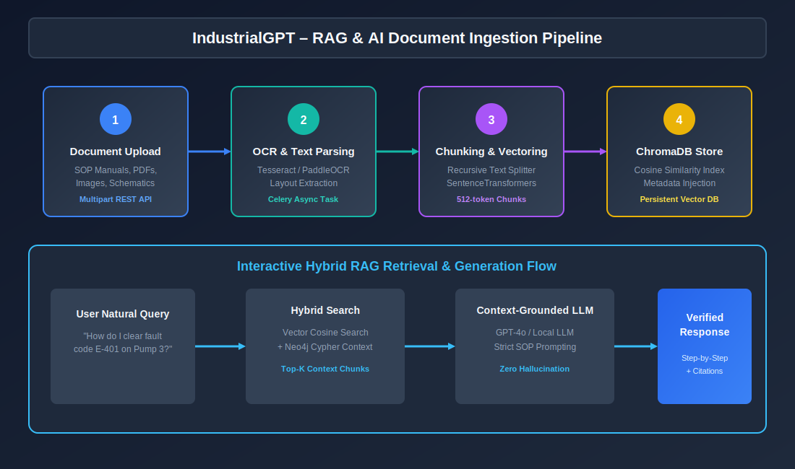
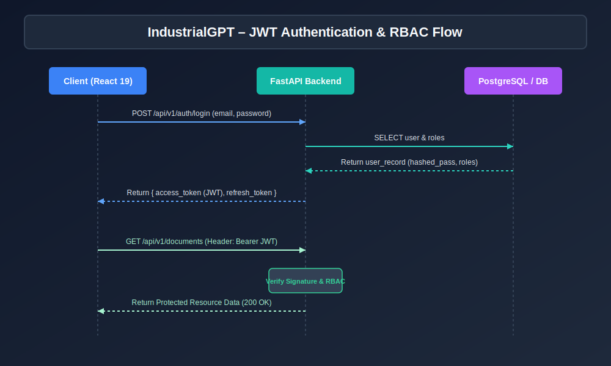

# IndustrialGPT Technical Architecture Document


## 1. High-Level Architecture Overview

IndustrialGPT is engineered around **Clean Architecture** and **SOLID Principles**, maintaining strict layer separation:

- **Presentation Layer**: React 19 single-page application with modular feature directories (`features/chat`, `features/documents`, `features/graph`, `features/maintenance`, `features/analytics`, `features/settings`).
- **Application Layer**: FastAPI endpoints with request lifecycle validation, dependency injection, and security middleware.
- **Business Service Layer**: Async domain services (`RAGService`, `KnowledgeGraphService`, `PredictiveMaintenanceService`).
- **Data Persistence Layer**: PostgreSQL via SQLAlchemy 2.x Async ORM, ChromaDB vector store, Redis caching, and Neo4j graph cluster.

---

## 2. RAG & AI Pipeline



```
[Uploaded Document] -> [Tesseract / PaddleOCR] -> [Text Chunks] -> [Sentence Transformers]
                                                                          |
                                                                          v
[AI Response] <- [GPT-4o / Claude] <- [Context Builder] <- [ChromaDB Vector Search]
```

1. **Ingestion**: Documents are uploaded via multipart stream, validated, and pushed to Celery task queues.
2. **OCR & Parsing**: Tesseract / PaddleOCR extracts structured layout text.
3. **Embedding**: Text chunks are embedded using SentenceTransformers into 384/1536 dimensional vectors.
4. **Retrieval**: User queries perform hybrid cosine similarity search against ChromaDB, returning top-k grounded citations.

---

## 3. Knowledge Graph Architecture


- **Engine**: Neo4j Graph Database.
- **Nodes**: `Asset`, `SOP`, `MaintenanceLog`, `Sensor`, `Anomaly`, `Regulation`.
- **Relationships**: `GOVERNS_MAINTENANCE`, `PERFORMED_ON`, `MONITORS`, `TRIGGERED_BY`, `COMPLIES_WITH`.
- **Querying**: Cypher query engine returning node coordinates and relationship connections for frontend SVG graph rendering.

---

## 4. Predictive Maintenance Algorithm

The RUL (Remaining Useful Life) calculation combines sensor telemetry (Vibration mm/s, Temperature °C, Oil Purity %) via heuristic ML risk scoring:

$$\text{Risk Score} = \min\left(100.0, \, (V \cdot 10) + (T \cdot 0.5) + (100 - O) \cdot 0.4\right)$$

$$\text{RUL Hours} = \max\left(10.0, \, 2000.0 - (\text{Risk Score} \cdot 18.0)\right)$$

---

## 5. Security Architecture



- **Authentication**: JWT Bearer Tokens signed with HMAC-SHA256 (`python-jose`).
- **Passland Security**: Bcrypt password hashing (`passlib[bcrypt]`).
- **Authorization**: Fine-grained RBAC enforcing domain privileges (`admin`, `engineer`, `operator`, `auditor`).
- **Transport Security**: TLS 1.3 encryption on Nginx reverse proxy.
