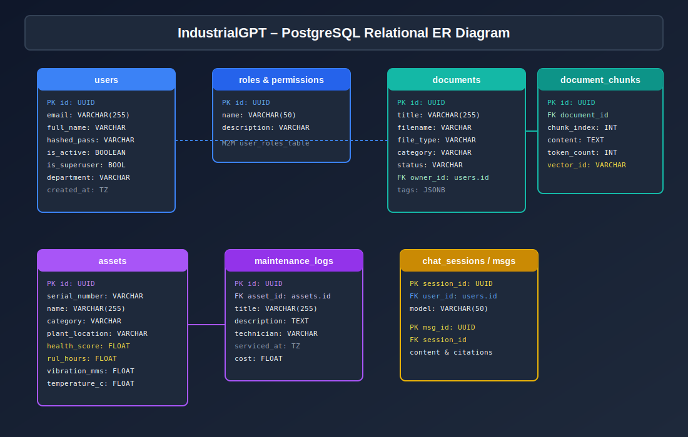
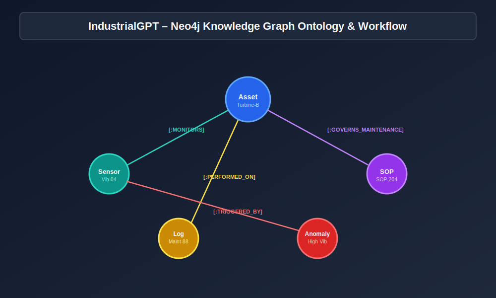

# IndustrialGPT Database Schema Documentation



## PostgreSQL Relational Schema (SQLAlchemy 2.x Async ORM)

### 1. `users` Table
| Column | Type | Constraints | Description |
| :--- | :--- | :--- | :--- |
| `id` | UUID | PRIMARY KEY | Unique user ID |
| `email` | VARCHAR(255) | UNIQUE, NOT NULL, INDEX | User login email |
| `full_name` | VARCHAR(255) | NOT NULL | User display name |
| `hashed_password` | VARCHAR(255) | NOT NULL | Bcrypt hashed password |
| `is_active` | BOOLEAN | DEFAULT True | Active state flag |
| `is_superuser` | BOOLEAN | DEFAULT False | Superuser admin flag |
| `department` | VARCHAR(100) | NULLABLE | Department name |
| `created_at` | TIMESTAMP TZ | DEFAULT NOW() | Account creation time |

### 2. `roles` & `permissions` Tables
- `roles` (`id`, `name`, `description`)
- `permissions` (`id`, `name`, `description`)
- `user_roles` (`user_id`, `role_id`)
- `role_permissions` (`role_id`, `permission_id`)

### 3. `documents` Table
| Column | Type | Constraints | Description |
| :--- | :--- | :--- | :--- |
| `id` | UUID | PRIMARY KEY | Document ID |
| `title` | VARCHAR(255) | INDEX | Document title |
| `filename` | VARCHAR(255) | NOT NULL | Stored filename |
| `file_type` | VARCHAR(50) | NOT NULL | Extension (PDF, PNG, etc.) |
| `file_size_bytes` | INTEGER | NOT NULL | File size |
| `storage_path` | VARCHAR(512) | NOT NULL | File path |
| `category` | VARCHAR(100) | INDEX | Category tag |
| `status` | VARCHAR(50) | INDEX | Processing status |
| `tags` | JSONB | DEFAULT [] | Document tags |
| `owner_id` | UUID | FK -> `users.id` | Document uploader |

### 4. `document_chunks` Table
- `id`: UUID (PK)
- `document_id`: UUID (FK -> `documents.id`)
- `chunk_index`: INTEGER
- `content`: TEXT
- `token_count`: INTEGER
- `vector_id`: VARCHAR(255)

### 5. `assets` Table
| Column | Type | Constraints | Description |
| :--- | :--- | :--- | :--- |
| `id` | UUID | PRIMARY KEY | Asset ID |
| `serial_number` | VARCHAR(100) | UNIQUE, INDEX | Asset serial number |
| `name` | VARCHAR(255) | INDEX | Equipment name |
| `category` | VARCHAR(100) | NOT NULL | Equipment category |
| `plant_location` | VARCHAR(255) | NOT NULL | Location in plant |
| `health_score` | FLOAT | DEFAULT 100.0 | Overall health score % |
| `rul_hours` | FLOAT | DEFAULT 1000.0 | Estimated RUL in hours |
| `vibration_mms` | FLOAT | DEFAULT 0.0 | Sensor vibration mm/s |
| `temperature_c` | FLOAT | DEFAULT 0.0 | Sensor temperature °C |
| `oil_quality_pct` | FLOAT | DEFAULT 100.0 | Oil purity percentage |

### 6. `maintenance_logs` Table
- `id`: UUID (PK)
- `asset_id`: UUID (FK -> `assets.id`)
- `title`: VARCHAR(255)
- `description`: TEXT
- `technician_name`: VARCHAR(255)
- `serviced_at`: TIMESTAMP TZ
- `cost`: FLOAT

---

## Neo4j Graph Database Ontology



```cypher
(:Asset {id, name, serial_number}) -[:MONITORS]-> (:Sensor {id, serial_number, type})
(:SOP {id, title, page_number}) -[:GOVERNS_MAINTENANCE]-> (:Asset)
(:MaintenanceLog {id, title}) -[:PERFORMED_ON]-> (:Asset)
(:Anomaly {id, type}) -[:TRIGGERED_BY]-> (:Sensor)
```
