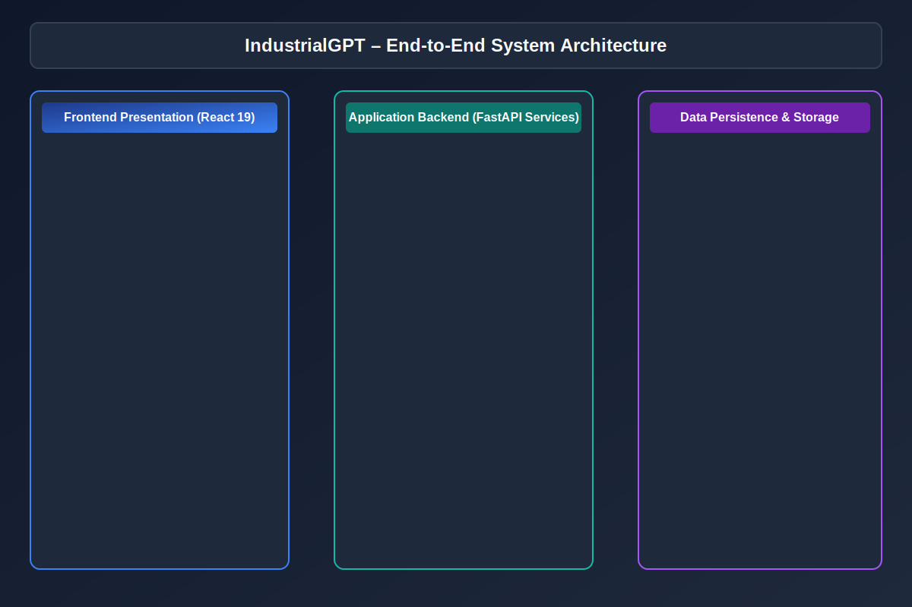

# IndustrialGPT Technical Architecture Document

## 1. High-Level Architecture Overview

IndustrialGPT is engineered around **Clean Architecture** and **SOLID Principles**, maintaining strict layer separation:

- **Presentation Layer**: React 19 single-page application with modular feature directories (`features/chat`, `features/documents`, `features/graph`, `features/maintenance`, `features/analytics`, `features/settings`).
- **Application Layer**: FastAPI endpoints with request lifecycle validation, dependency injection, and security middleware.
- **Business Service Layer**: Async domain services (`RAGService`, `KnowledgeGraphService`, `PredictiveMaintenanceService`).
- **Data Persistence Layer**: PostgreSQL via SQLAlchemy 2.x Async ORM, ChromaDB vector store, Redis caching, and Neo4j graph cluster.

---

## 2. RAG & AI Pipeline

---

## 3. Knowledge Graph Architecture

---

## 4. Security Architecture

