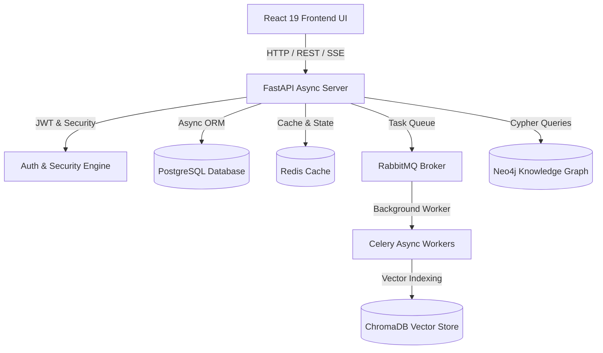
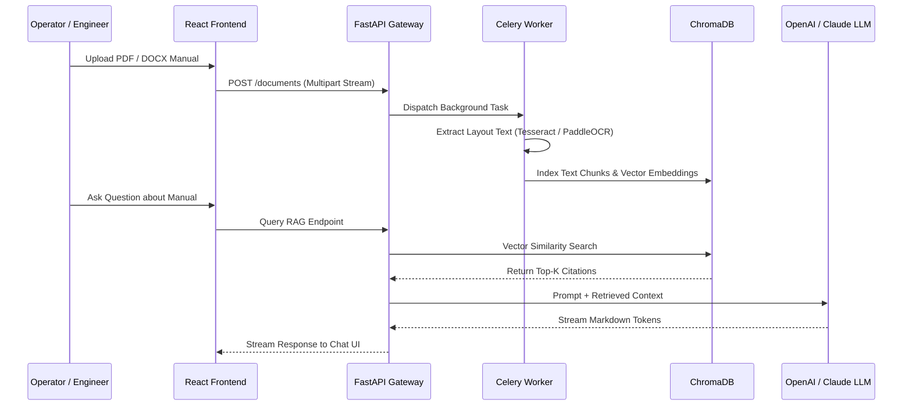
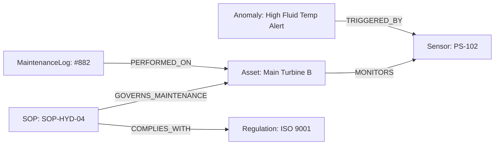

# IndustrialGPT Architectural Diagrams

## 1. System Architecture Overview

```mermaid
graph TD
    Client[React 19 Frontend UI] -->|HTTP / REST / SSE| API[FastAPI Async Server]
    API -->|JWT & Security| Auth[Auth & Security Engine]
    API -->|Async ORM| DB[(PostgreSQL Database)]
    API -->|Cache & State| Redis[(Redis Cache)]
    API -->|Task Queue| MQ[RabbitMQ Broker]
    MQ -->|Background Worker| Celery[Celery Async Workers]
    Celery -->|Vector Indexing| Chroma[(ChromaDB Vector Store)]
    API -->|Cypher Queries| Neo4j[(Neo4j Knowledge Graph)]
```

---

## 2. Document Ingestion & RAG Flow

```mermaid
sequenceDiagram
    participant User as Operator / Engineer
    participant FE as React Frontend
    participant API as FastAPI Gateway
    participant Worker as Celery Worker
    participant Chroma as ChromaDB
    participant LLM as OpenAI / Claude LLM

    User->>FE: Upload PDF / DOCX Manual
    FE->>API: POST /documents (Multipart Stream)
    API->>Worker: Dispatch Background Task
    Worker->>Worker: Extract Layout Text (Tesseract / PaddleOCR)
    Worker->>Chroma: Index Text Chunks & Vector Embeddings
    User->>FE: Ask Question about Manual
    FE->>API: Query RAG Endpoint
    API->>Chroma: Vector Similarity Search
    Chroma-->>API: Return Top-K Citations
    API->>LLM: Prompt + Retrieved Context
    LLM-->>API: Stream Markdown Tokens
    API-->>FE: Stream Response to Chat UI
```

---

## 3. Knowledge Graph Topology

```mermaid
graph LR
    Asset[Asset: Main Turbine B] -->|MONITORS| Sensor[Sensor: PS-102]
    SOP[SOP: SOP-HYD-04] -->|GOVERNS_MAINTENANCE| Asset
    Log[MaintenanceLog: #882] -->|PERFORMED_ON| Asset
    Anomaly[Anomaly: High Fluid Temp Alert] -->|TRIGGERED_BY| Sensor
    SOP -->|COMPLIES_WITH| Reg[Regulation: ISO 9001]
```
